<div align="center">

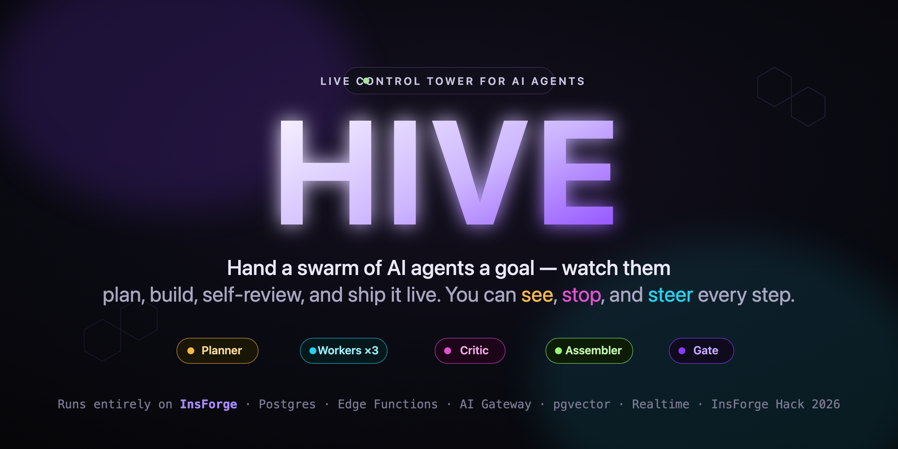

<br/>

# HIVE

### The live control tower for AI agents.

**Hand a swarm of AI agents a goal — then watch a transparent team plan, execute in parallel, review their own work, and ship a finished artifact.** Live cost meter. Hard risk gates that *stop and ask*. One-click intervention the whole way. It runs **entirely on [InsForge](https://insforge.dev)** — Postgres, edge functions, AI gateway, pgvector, realtime, auth, and storage, wired into one living product.

<br/>

[](https://nmf6vbv4.insforge.site)
&nbsp;
[](https://insforge.dev)

<br/>


<br/>

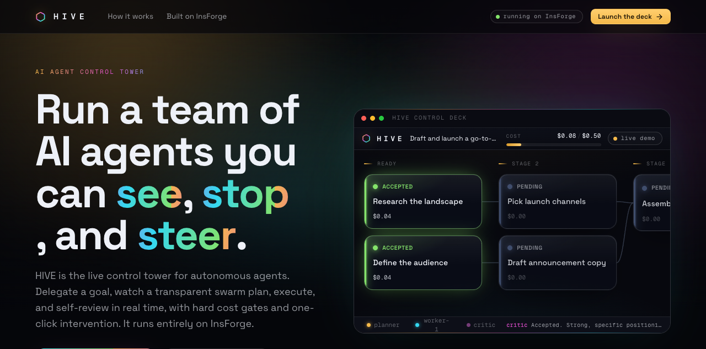

</div>

---

## The problem

AI agents reach production faster than anyone can govern them. One unattended loop can burn a budget overnight; one bad write can wipe a database; a long task can fail silently with no trace of *why*. So most teams either babysit their agents — or keep them out of production entirely.

**HIVE makes an agent swarm safe to run.** It is a glass control room: every time an agent has a thought, claims a task, spends money, or trips a safety gate, it writes a row to Postgres — and **that write *is* the broadcast.** You watch the swarm think because the swarm *thinking* and the swarm *rendering* are the same event stream. And because it is observable, it is also **interruptible and accountable**: pause it, steer it, raise its budget, approve or deny a high-impact step, and read a full causal record of everything it did.

> **In one line:** every other agent demo shows you the *output*. HIVE shows you the *thinking* — live, governable, and on a real backend.

---

## The signature moment

A worker reaches a consequential step. The swarm **stops itself and asks.** Nothing runs until you decide. You approve (or inject a constraint and *then* approve), and it continues — live, on the real backend.

<div align="center">
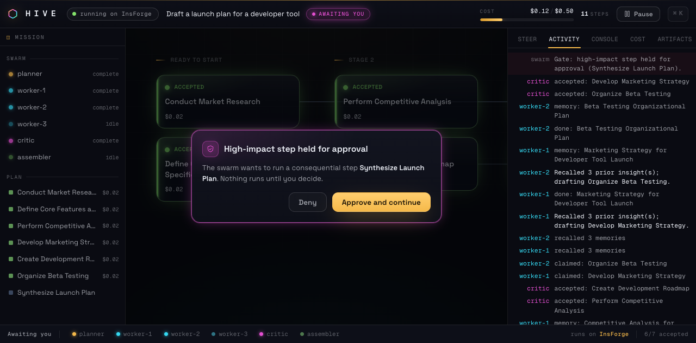
</div>

---

## How it all fits together

Every box below is real and exercised on each run. The swarm's thoughts flow *down* through Postgres into your browser; your steering flows *back up* through an interventions queue. No polling, no glue services — the database trigger is the wire.

<div align="center">
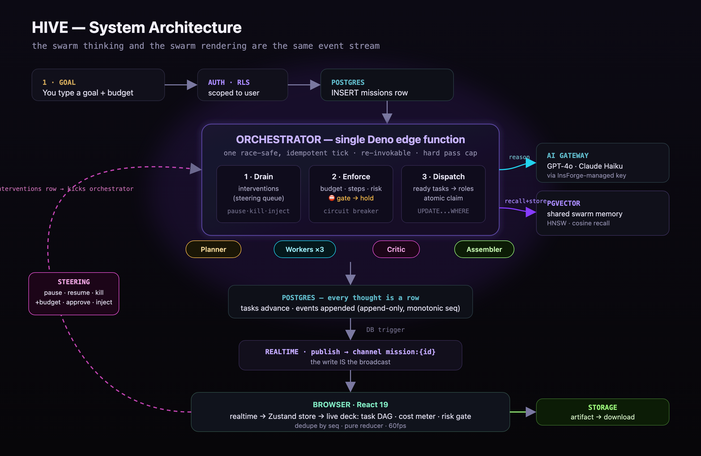
</div>

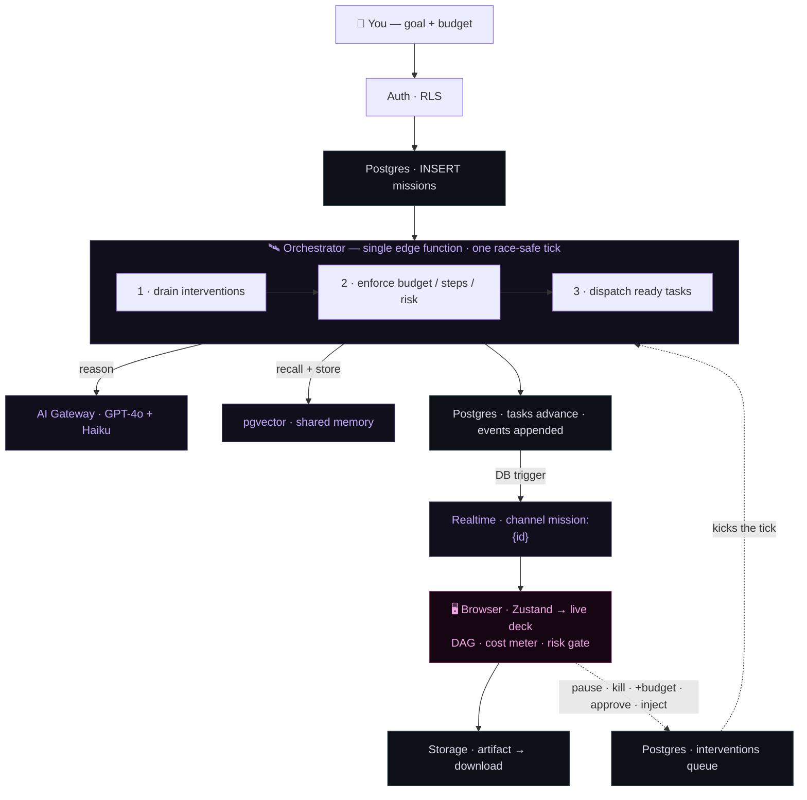

The orchestration is **tick-based**, so nothing runs forever. On each tick the orchestrator finds tasks whose dependencies are met, **claims them atomically** (`UPDATE ... WHERE status = 'pending'`, so two ticks never grab the same task), and runs the roles inline. Every transition is a guarded atomic `UPDATE`, which makes re-invocation **idempotent** and the whole thing **race-safe**. The browser kick, the post-intervention kick, and a cron sweep all re-invoke it; a hard pass cap bounds every run.

---

## The swarm — 6 agents, 4 roles, 1 tick

Six agents, four roles — all executed by the same `orchestrator` tick with different prompts and behaviors.

<div align="center">
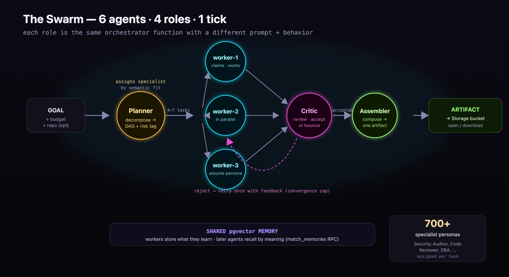
</div>

| Role | Color | What it does |
| --- | --- | --- |
| **Planner** | 🟡 amber | Decomposes the goal into a **4–7 task dependency DAG**, tags one high-impact step as a **risk**, and assigns each task a **specialist** from a catalog of **700+ expert personas** (a Security Auditor for the dependency task, a Code Reviewer for the hotspot) by semantic fit. |
| **Workers ×3** | 🔵 cyan | Claim ready tasks **in parallel**, **assume the assigned specialist persona**, recall relevant memories from pgvector, reason through the AI gateway, write results, and store new memories. |
| **Critic** | 🟣 magenta | Reviews completed work and can **bounce a task back** with feedback. A convergence cap (one retry, then accept) holds a high bar without ever looping forever. |
| **Assembler** | 🟢 green | Composes the accepted outputs into **one artifact** and uploads it to Storage. |

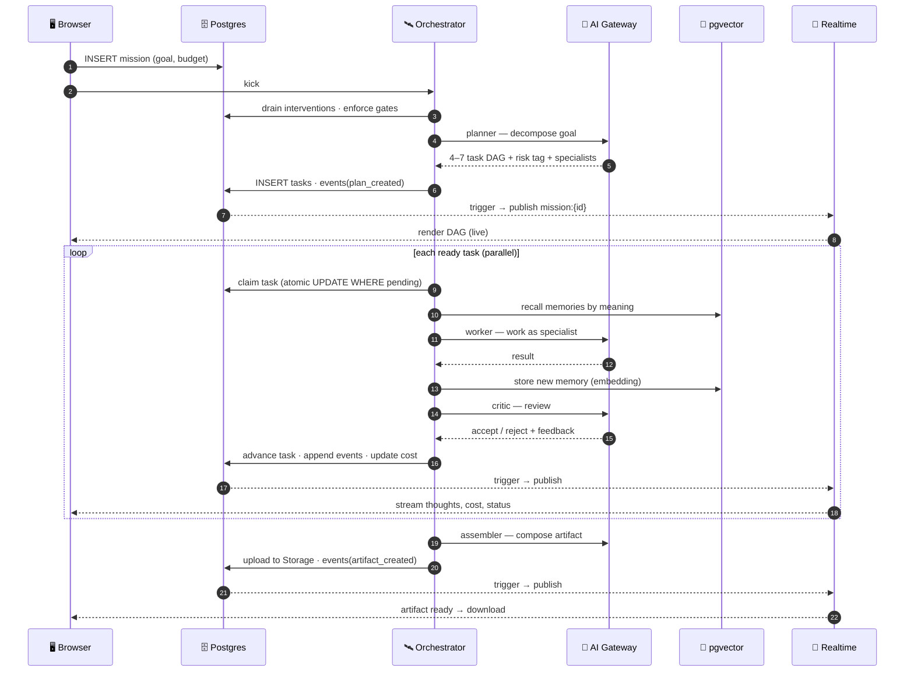

---

## The control tower — govern · steer · audit

Three subsystems turn the swarm from a black box into something you can **govern, observe, and steer** — all enforced in the backend and surfaced in the cockpit.

<div align="center">
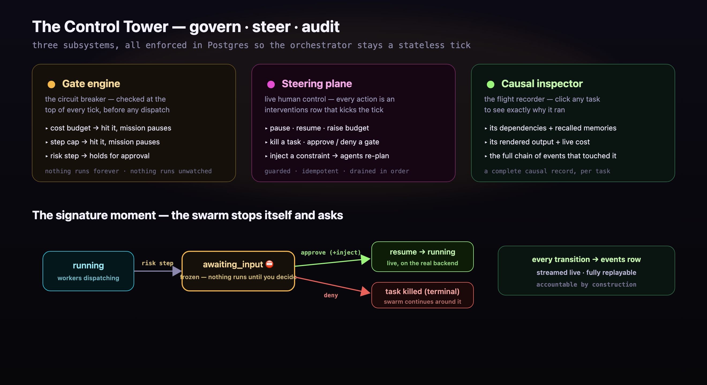
</div>

- **🟡 Gate engine (the circuit breaker).** Each mission carries a cost budget and a step cap, and the planner tags one high-impact step. The orchestrator checks all three at the top of *every* tick, *before* any dispatch. Hit the budget or step cap → the mission pauses. Reach the risk step → it holds for explicit approval.
- **🟣 Steering control plane (live human control).** Every cockpit action (pause, resume, raise budget, kill a task, approve/deny a gated step, inject a constraint) inserts an `interventions` row and kicks the orchestrator, which drains the queue and applies each one with guarded, idempotent updates. Injected constraints append to the mission guidance and the agents **re-plan around them**.
- **🟢 Causal inspector (the flight recorder).** Click any task to see *why* it ran — its dependencies and recalled memories — its rendered output, its live cost, and the chain of events that touched it.

### The mission & task lifecycles

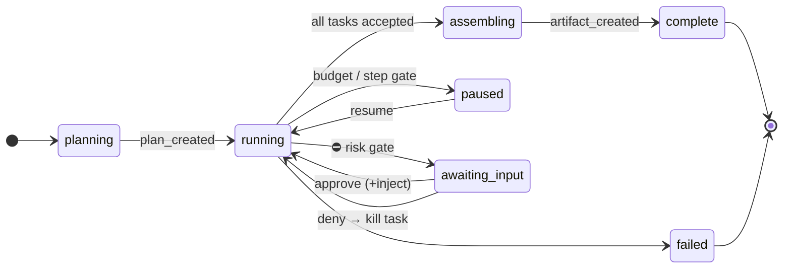

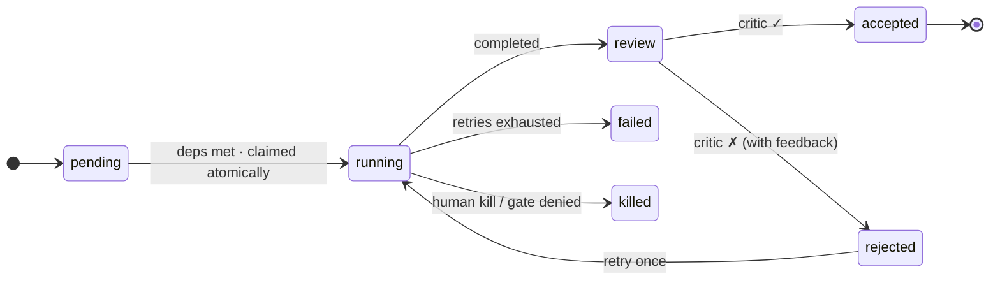

<div align="center">
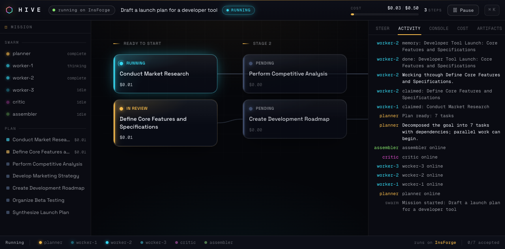
</div>

---

## Every InsForge primitive, composed into one living system

This is the point of the project: **not one primitive used well, but the whole platform wired into a single product.** Every row is real and exercised on each run.

<div align="center">
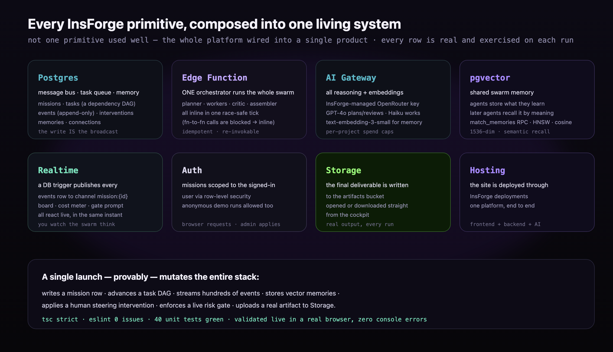
</div>

| InsForge primitive | Role in HIVE |
| --- | --- |
| **Postgres** | The message bus, task queue, and memory. `missions` (budget, spend, step count, guidance), `tasks` (a dependency DAG with per-task cost and a risk flag), `events` (append-only log), `memories`, `interventions` (the steering queue), `connections` (read-only GitHub tokens). |
| **Edge function** | A **single** `orchestrator` runs the whole swarm. (InsForge blocks function-to-function calls with HTTP 508, so planner, workers, critic, and assembler all run inline in one race-safe tick.) |
| **AI gateway** | All reasoning and embeddings, through an **InsForge-managed OpenRouter key** with per-project spend caps and usage logging. GPT-4o plans/reviews/assembles; Claude 3.5 Haiku does the work; `text-embedding-3-small` powers memory. |
| **pgvector** | Shared swarm memory. Agents store what they learn; later agents recall it by meaning (`match_memories` RPC, HNSW cosine index). |
| **Realtime** | A database trigger publishes every `events` row to channel `mission:{id}`. The board, the cost meter, and the gate prompt all react live. |
| **Auth** | Missions scoped to the signed-in user via RLS (anonymous demo runs allowed). |
| **Storage** | The final deliverable is written to the `artifacts` bucket and opened or downloaded straight from the cockpit. |
| **Hosting** | The site is deployed through InsForge deployments. |

### The data model

The tables are the **frozen contract** shared by the frontend and the edge functions. Columns are `snake_case`; event payloads mirror them in `camelCase` so the browser reconstructs each `SwarmEvent` as `{ type, ...payload }`.

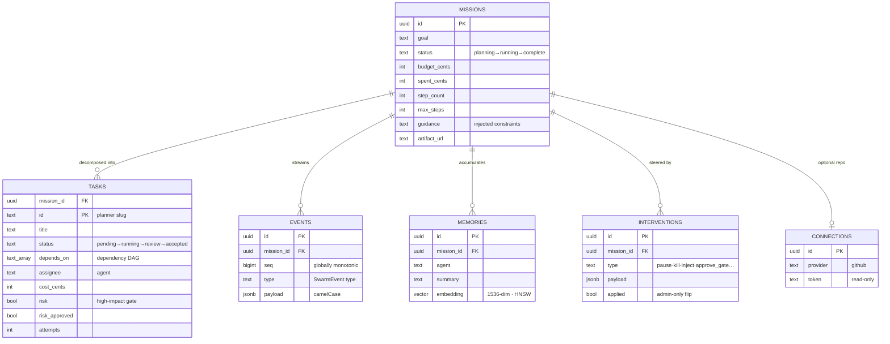

> A single global `hive_event_seq` sequence guarantees strictly increasing, unique `seq` values across every writer — so the frontend dedup (drop `seq <= lastSeq`) never discards a real event, even under concurrent ticks.

---

## Point it at your codebase

A mission can be scoped to a GitHub repository. Paste a public `owner/repo` (no token), or connect a read-only token to reach private repos and your own list. The orchestrator pulls a **bounded, prompt-sized snapshot** of the repo — a compact file tree plus the key orientation files — and folds it into the planner and workers, so the swarm reasons over your *real* code.

It is strictly **read-only**: HIVE never commits, pushes, or mutates the repo. Point it at a repo and the swarm becomes a code-review team — map the architecture, audit the dependencies, find the hotspots, propose ranked fixes, and ship a review report — under the same budget, gates, and live steering as any other mission.

## The clarifier

Before a mission launches, a short clarifier chat pins down intent: it asks a couple of sharp questions about scope and constraints, recommends the specialists it will assign, and folds your answers into the mission guidance the agents honor throughout. **The swarm starts aligned instead of guessing.**

---

## Built with

- **Frontend:** React 19 + Vite + TypeScript, a [Zustand](https://github.com/pmndrs/zustand) store fed by InsForge realtime, and the **HIVE Design System** — a cinematic, luminous, motion-first dark system (Space Grotesk + Geist Mono, role-colored spectrum, glass nodes, GPU-friendly motion). No component library, no template aesthetic.
- **Backend:** InsForge (Postgres, edge functions, AI gateway, pgvector, realtime, auth, storage), a Deno orchestrator, OpenRouter-via-InsForge models.

## Run it

Prerequisites: Node 20+.

```bash
npm install
npm run dev
```

Open the deck with the simulation flag to watch a full mission run end to end with **no backend required**:

```
http://localhost:5173/?sim
```

The simulation replays a mission through the **exact same event pipeline and reducer** the live backend uses — so what you see offline is what the live swarm produces. To run against a real InsForge project, set `VITE_INSFORGE_URL` and `VITE_INSFORGE_ANON_KEY`, then launch a mission from the deck. Full live deployment steps (migrations, function deploy, AI key setup, site deploy) are in [`docs/deploy.md`](docs/deploy.md).

## Quality bar

Held to a product standard, not a hackathon standard.

- **TypeScript strict** across the codebase. `tsc`, `eslint` (**0 issues**), and the unit suite (**40 tests** over the reducer and orchestration logic) are all green and gate every change.
- **Validated live in a real browser:** the full mission lifecycle — launch, parallel work, pgvector recall, a critic bounce, a risk gate, live steering, a shipped artifact — renders on the deployed backend with **zero console errors**.
- **The whole InsForge stack mutates on every run, provably:** a single launch writes a mission row, advances a task DAG, streams hundreds of events, stores vector memories, applies a human steering intervention, and uploads a real artifact.

## Repository layout

```
hive/
  src/
    ui/           the live control deck + the cinematic landing
      design/     the HIVE Design System: tokens + 12 typed primitives
    state/        the zustand swarm store, the realtime→deck adapter, the simulation
    lib/          the InsForge client, the GitHub connector, the mission + steering API,
                  the agent catalog, the swarm protocol (types.ts)
  functions/
    orchestrator  the single edge function: the race-safe gated tick that runs every
                  role and pulls read-only repo context
    clarify       the pre-launch clarifier (scope questions + specialist recommendations)
  migrations/     SQL: tables, RLS, the realtime publish trigger, pgvector,
                  the control tower, the GitHub connections table
  docs/           deploy guide + media (diagrams, screenshots)
```

---

<div align="center">

### Agents you can trust in production.

**Hand them a goal. Watch them work. Stay in command.**

[](https://nmf6vbv4.insforge.site)

<sub>Built for the InsForge Hack · June 2026</sub>

</div>
